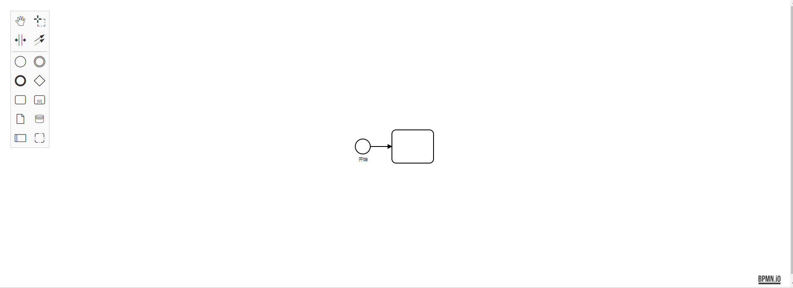

# 基础使用

- [Viewer](https://github.com/bpmn-io/bpmn-js/blob/master/lib/Viewer.js) BPMN 图表查看器
- [NavigatedViewer](https://github.com/bpmn-io/bpmn-js/blob/master/lib/NavigatedViewer.js) 包含鼠标导航工具的图表查看器
- [Modeler](https://github.com/bpmn-io/bpmn-js/blob/master/lib/Modeler.js) BPMN 图表建模器

`Viewer` 功能最简单，仅用来展示

`NavigatedViewer` 在 `Viewer` 上扩展了导航和缩放功能

`Modeler` 融合了 `Viewer 和 NavigatedViewer`,并拥有工具栏、属性面板等，实现建模能力

---

## 快速上手(Vue)

安装依赖

```bash
npm install bpmn-js -S
```

html

```html
<div ref="canvas" class="canves"></div>
```

css

```css
.canves {
  width: 100%;
  height: 100vh;
}
```

### Viewer

Viewer 用于展示

js

```js
import Modeler from 'bpmn-js/lib/Viewer'
import { xmlStr } from './xmlData.js'
export default {
  data() {
    return {
      bpmnViewer: null
    }
  },
  async mounted() {
    this.bpmnViewer = new Modeler({
      container: this.$refs.canvas
    })

    try {
      const { warnings } = await this.bpmnViewer.importXML(xmlStr)
      // 调整在正中间
      this.bpmnViewer.get('canvas').zoom('fit-viewport', 'auto')
      console.log('rendered')
    } catch (err) {
      console.log('error rendering', err)
    }
  }
}
```

- [xmlStr](../src/components/xmlData.js)

---

### NavigatedViewer

NavigatedViewer 显示和导航 BPMN 图

在 Viewer 的基础上，小小的修改

```js
import Modeler from 'bpmn-js/lib/Viewer'
```

改为 👇

```js
import Modeler from 'bpmn-js/lib/NavigatedViewer'
```

---

### Modeler

js

```js
import Modeler from 'bpmn-js/lib/Modeler'
import 'bpmn-js/dist/assets/diagram-js.css' // 左边工具栏以及编辑节点的样式
import 'bpmn-js/dist/assets/bpmn-font/css/bpmn.css'
import 'bpmn-js/dist/assets/bpmn-font/css/bpmn-codes.css'
import 'bpmn-js/dist/assets/bpmn-font/css/bpmn-embedded.css'
import { xmlStr } from './xmlData.js'
export default {
  data() {
    return {
      bpmnModeler: null
    }
  },
  async mounted() {
    this.bpmnModeler = new Modeler({
      container: this.$refs.canvas
    })

    try {
      const { warnings } = await this.bpmnModeler.importXML(xmlStr)
      // 调整在正中间
      this.bpmnModeler.get('canvas').zoom('fit-viewport', 'auto')
      console.log('rendered')
    } catch (err) {
      console.log('error rendering', err)
    }
  }
}
```

注意：高度应为 `可计算值或固定值`，否则画布计算高度错误会导致元素消失闪烁

到此已经成功，如图：


## 最后

可能你的 UI 图并不长这样，甚至没有你想要的功能。

没关系，BPMN 提供了许多模块 以及 API 支持自定义扩展，能够满足大部分需求，在深入定制前，[先了解下 BPMN 内部吧！~](./quickIntroduction.md)
