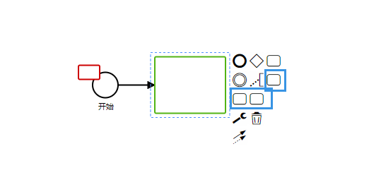
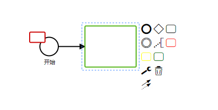
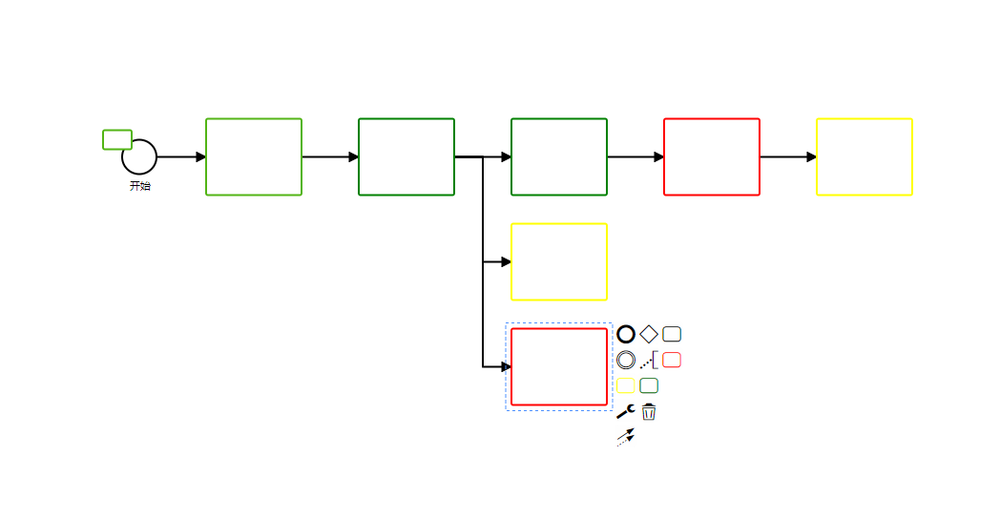

# 自定义 contextPad

在 [自定义 contextPad](./customRenderer.md) 的基础上继续修改

案例代码在这里取：

customContextPad

## 开始

`自定义 contextPad` 和 `自定义 Palette` 步骤差不多

#### 1. 创建相关文件

建立自定义内容面板的相关文件，结构如下

```cmd
| -- contextPad
    |-- CustomContextPad.js
    |-- index.js
```

这里比较方便直接去官方的 Demo 中取代码
[bpmn-js-example-custom-elements](https://github.com/bpmn-io/bpmn-js-example-custom-elements/blob/master/app/custom/CustomContextPad.js)

接下来是 index.js

```js
import CustomContextPad from './CustomContextPad'

export default {
  __init__: ['customContextPad'],
  customContextPad: ['type', CustomContextPad]
}
```

#### 2. 引用

引入刚刚创建的文件

```js
import customContextPad from './contextPad'
```

```js
export default {
  // ...
  init() {
    this.bpmnModeler = new BpmnModeler({
      additionalModules: [customContextPad]
    })
    // ...
  }
}
```

你会发现自定义内容面板已经成功了,多出了三个面板



#### 3. 查看 CustomContextPad

回到 `CustomContextPad.js`

```js
 'append.low-task': {
        group: 'model',
        className: 'bpmn-icon-task red',
        title: translate('Append Task with low suitability score'),
        action: {
          click: appendServiceTask(SUITABILITY_SCORE_LOW),
          dragstart: appendServiceTaskStart(SUITABILITY_SCORE_LOW)
        }
      }
```

这次通过类名来修改外观， palette 是通过图片。

```css
.bpmn-icon-task.red {
  color: red;
}
.bpmn-icon-task.yellow {
  color: yellow;
}
.bpmn-icon-task.green {
  color: green;
}
```

vue 注意引用，不要在局部样式中引入，会无效
这里为了方便，直接在 main.js 引入

```js
import '@/components/css/bpmn.less'
```



可以发现内容面板样式已经更改，但是渲染还没有效果，这里还需要修改一下渲染方法。

#### 修改 paletteEntries

之前已经将自定义渲染方法集中在 `paletteEntries.js` 中

由于在 `CustomContextPad.js` 定义了得分

```js
const SUITABILITY_SCORE_HIGH = 100
const SUITABILITY_SCORE_AVERGE = 50
const SUITABILITY_SCORE_LOW = 25
```

并赋值给每个元素的 `businessObject.suitable`

这样我们就可以在渲染的时候判断得分展示对应的分数

```js
function drawShape(parentNode, element, bpmnRenderer) {
  const shape = bpmnRenderer.drawShape(parentNode, element)
  const suitable = element.businessObject.suitable
  let color = '#52B415' // 默认颜色
  if (suitable) {
    if (suitable > 50) {
      color = 'green'
    }
    if (suitable === 50) {
      color = 'yellow'
    }
    if (suitable < 50) {
      color = 'red'
    }
  }
  if (is(element, 'bpmn:Task')) {
    const height = 80
    const width = 100
    element.width = width
    element.height = height
    const rect = drawRect(parentNode, width, height, TASK_BORDER_RADIUS, color)

    prependTo(rect, parentNode)

    svgRemove(shape)

    return shape
  }

  const rect = drawRect(parentNode, 30, 20, TASK_BORDER_RADIUS, color)

  svgAttr(rect, {
    transform: 'translate(-20, -10)'
  })

  return shape
}
```

大功告成！



## 最后

以上，只是简单举例了如何修改自定义内容面板。
如果去除它默认的内容，由于使用几率比较少,可以修改它的提供器，就像 [customPalette](./customPalette.md)。

下一步，[自定义属性面板](#)

### 相关

可能对你有帮助的官方资源：

- [bpmn-js-example-custom-elements ](https://github.com/bpmn-io/bpmn-js-example-custom-elements)
