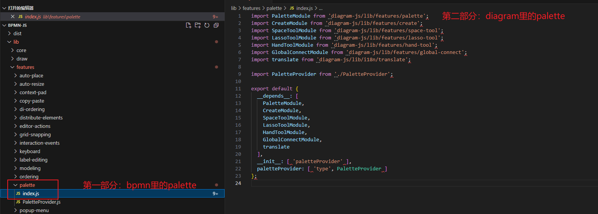
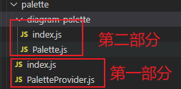
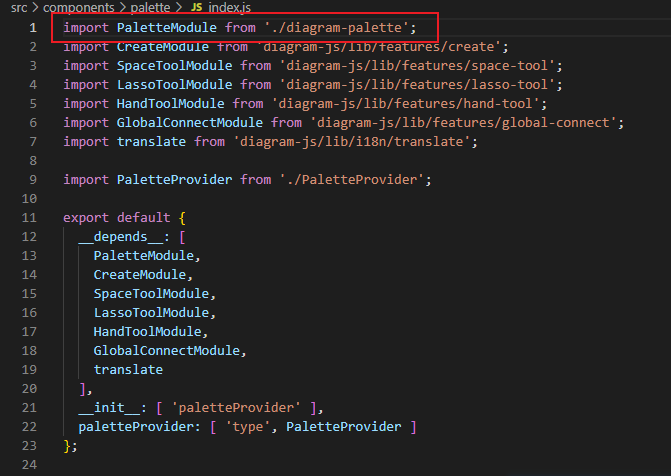
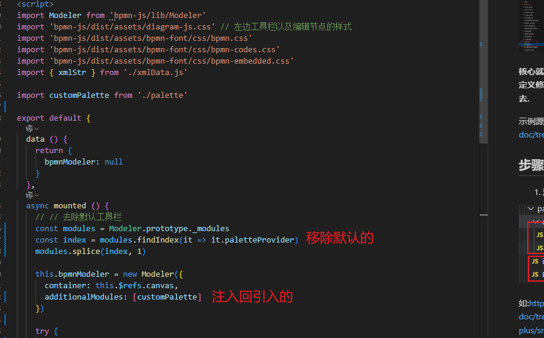
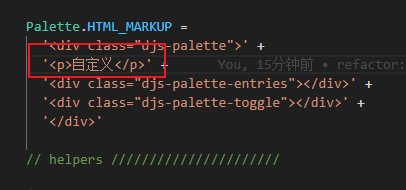
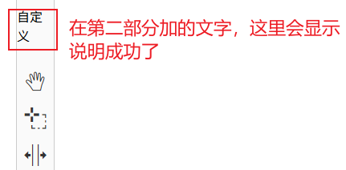

# 最简单实现Palette

首先我们知道`bpmn-js`是封装`diagram-js`.

所以工具栏Palette也是有两部分.

**核心就是把这两部分提取出来到我们项目中,进行自定义修改后(如HTML样式\工具栏内容等),再注入回去.**

示例源码:[https://github.com/PL-FE/bpmn-doc/tree/customPalette-plus](https://github.com/PL-FE/bpmn-doc/tree/customPalette-plus)

## 步骤

1. 源码文件复制出来到自己项目中,如下图

修改工具栏内容一般在第一部分,修改工具栏样式布局一般在第二部分.

如:[https://github.com/PL-FE/bpmn-doc/tree/customPalette-plus/src/components/palette](https://github.com/PL-FE/bpmn-doc/tree/customPalette-plus/src/components/palette)

2. 修改下引用

3.注入回去

## 效果

