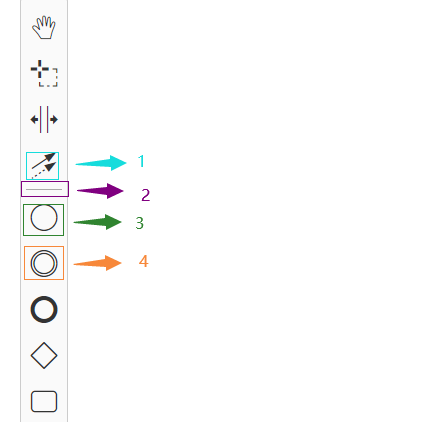
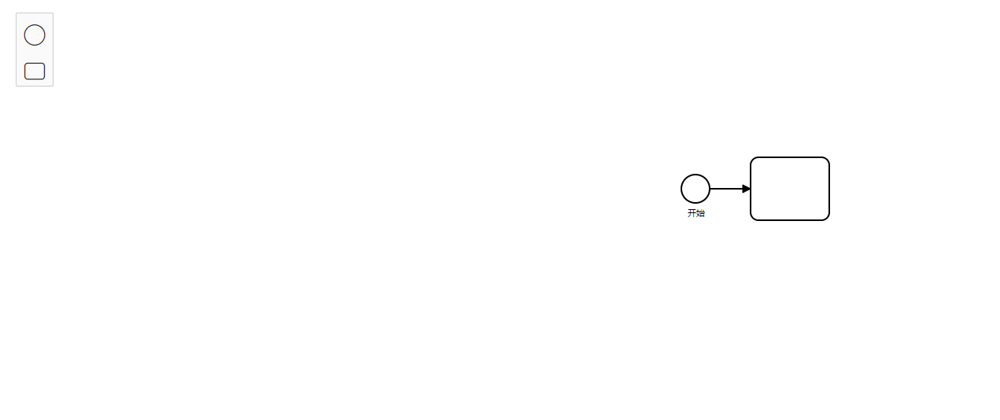
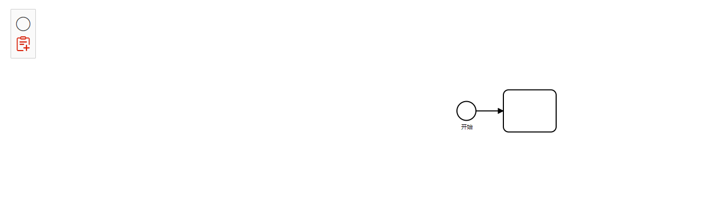

# 自定义 Palette

[了解 BPMN 内部](quickIntroduction.md)后，对一些模块以及它们之间的配合应该有了一定的概念，下面开始动手尝试修改一下 `palette` 工具栏

案例代码在这里取：

[customPalette](https://github.com/PL-FE/bpmn-doc/tree/customPalette)

---

## 开始

你可以实现

- 通过配置生成工具栏
- 自定义工具栏样式、布局
- 可指定工具栏容器

为了理解更简单

- 自定义工具栏样式、布局 (非必须，后续实现)
- 可指定工具栏容器(非必须，后续实现)

注意：标记 🎯 的地方为重点

#### 1. 创建相关文件

建立自定义工具栏的相关文件，结构如下

```cmd
| -- palette
    |-- CustomPaletteProvider.js
    |-- CustomPalette.js
    |-- index.js
```

PaletteProvider 顾名思义 `”调色板提供程序“`，也就是将工具栏的数据告诉 `Palette`，由 `Palette` 构造工具栏。

所以我们需要先将代码准备好，然后去修改它：

- 前往 [bpmn-js](https://github.com/bpmn-io/bpmn-js) 将源码 [PaletteProvider.js ](https://github.com/bpmn-io/bpmn-js/blob/develop/lib/features/palette/PaletteProvider.js) 拷贝至 CustomPaletteProvider.js
- 前往 [diagram-js](https://github.com/bpmn-io/diagram-js) 将源码 [Palette.js ](https://github.com/bpmn-io/diagram-js/blob/develop/lib/features/palette/Palette.js) 拷贝至 CustomPalette.js
- 参考 `PaletteProvider.js`和 `Palette.js` 对应的 `index.js`，将刚刚创建的 `index.js`，修改成如下

```js
import customPalette from './CustomPalette'
import PaletteProvider from './CustomPaletteProvider'
// 除了引进的模块的名字可以修改，其他的不建议修改，会报错
export default {
  __depends__: [
    {
      __init__: ['customPalette'],
      customPalette: ['type', customPalette]
    }
  ], // 依赖于 customPalette 这个模块
  __init__: ['customPaletteProvider'], // 调用 customPaletteProvider 来初始化
  customPaletteProvider: ['type', PaletteProvider]
}
```

到此三个文件已经准备就绪了，下面我们来引用它。

---

#### 2. 引用

引入刚刚创建的文件

```js
import customPalette from './palette'
```

```js
export default {
  // ...
  init() {
    this.bpmnModeler = new BpmnModeler({
      additionalModules: [customPalette]
    })
    // ...
  }
}
```

到此，当前页面应该是正常显示的，因为我们只是将文件拷贝出来，修改引用，方便后续的修改。

#### 3. 修改工具栏构造者 CustomPalette

修改 `CustomPalette.js` 文件

首先老规则，修改注入需要用的数据

```js
Palette.$inject = [
  'eventBus',
  'canvas',
  // ---------- 自定义区域 ------------
  'elementFactory',
  'create',
  'config.paletteContainer',
  'config.paletteEntries'
  // ---------- 自定义区域 ------------
]
```

默认只注入了两个，其余根据需要来增加。
下面将注入的数据赋值

```js
function Palette(
  eventBus,
  canvas,

  elementFactory,
  create,
  paletteContainer,
  paletteEntries
) {
  this._eventBus = eventBus
  this._canvas = canvas
  // 新增赋值
  this._entries = paletteEntries // 传入的工具栏数据
  this._paletteContainer = paletteContainer // 传入的工具栏容器
  this._elementFactory = elementFactory
  this._create = create
  // ...
}
```

然后就可以在这个函数中数据注入的数据了，
注意注入顺序和函数参数的顺序要一致哦~

到此，一个数据以及布局已经准备完毕，接下来该实现它的`拖动或者点击生成元素`的功能了

```js
Palette.prototype.trigger = function(action, event, autoActivate) {
  var entries = this._entries,
    entry,
    handler,
    originalEvent,
    button = event.delegateTarget || event.target

  // ---------- 自定义区域 ------------
  // 创建元素的方法需要这两个构造器
  var elementFactory = this._elementFactory,
    create = this._create
  // ---------- 自定义区域 ------------

  handler = entry.action

  originalEvent = event.originalEvent || event

  // simple action (via callback function)
  if (isFunction(handler)) {
    if (action === 'click') {
      handler(originalEvent, autoActivate, elementFactory, create)
    }
  } else {
    // ---------- 自定义区域 ------------
    if (handler[action]) {
      // 在原来 2 个参数的基础上，新增 2 个参数 elementFactory, create
      handler[action](originalEvent, autoActivate, elementFactory, create) // 🎯 这里便是回调 action.dragstart 或者click 或者 其他事件
    }
    // ---------- 自定义区域 ------------
  }

  event.preventDefault()
}
```

在 `init` 的时候绑定了两个事件，当我们点击或在拖动工具栏的时候触发，从而可以生成元素。

`CustomPalette.js` 至此基本修改完成了。

#### 4. 修改数据的提供者 PaletteProvider

现在开始修改 `PaletteProvider.js` 文件

修改前，可以先看一下 `PaletteProvider.prototype.getPaletteEntries` 这个方法

源码是在这个方法中将默认工具栏数据传入给 `palette.js`

可以学习一下他是如何构造工具栏数据的，后面会用到。

如下代码实现了一条分割线和三个事件

```js
// l
'global-connect-tool': {
  group: 'tools',
  className: 'bpmn-icon-connection-multi',
  title: translate('Activate the global connect tool'),
  action: {
    click: function (event) {
      globalConnect.toggle(event)
    }
  }
},
// 2
'tool-separator': {
  group: 'tools',
  separator: true
},
// 3
'create.start-event': createAction(
  'bpmn:StartEvent', 'event', 'bpmn-icon-start-event-none',
  translate('Create StartEvent')
),
// 4
'create.intermediate-event': createAction(
  'bpmn:IntermediateThrowEvent', 'event', 'bpmn-icon-intermediate-event-none',
  translate('Create Intermediate/Boundary Event')
)
```



因为我们的目的是希望有一个独立的文件来配置工具栏，而不是在源码中，所以我们开始简化这个 getPaletteEntries 如下：

```js
// 注意： 可以通过 config这个对象拿到 实例化 Modeler 的时候的参数
// 所以这里通过注入 congif.paletteEntries 拿到 paletteEntries 的值
// 后续会介绍如何传入
PaletteProvider.$inject = ['config.paletteEntries', 'customPalette']

export default function PaletteProvider(paletteEntries, customPalette) {
  this._entries = paletteEntries

  customPalette.registerProvider(this)
}

PaletteProvider.prototype.getPaletteEntries = function(element) {
  return this._entries // 🎯 返回工具栏数据
}
```

#### 5. 配置工具栏 paletteEntries

同级目录下新建 `config/paletteEntries.js`,

`paletteEntries.js` 的目的是返回一个包含工具数据的集合（对象或数组）
这里简单创建两个工具元素，`开始和结束`

```js
export default {
  'create.start-event': createAction(
    'bpmn:StartEvent',
    'event',
    'bpmn-icon-start-event-none',
    'Create StartEvent'
  ),
  'create.task': createAction(
    'bpmn:Task',
    'activity',
    'bpmn-icon-task',
    'Create Task'
  )
}

function createAction(type, group, className, title, options) {
  // 还记得 CustomPalette.js 吗？便是这里回调 createListener 函数
  // if (action === 'click') {
  // 		handler(originalEvent, autoActivate, elementFactory, create)
  // 	}
  function createListener(event, autoActivate, elementFactory, create) {
    var shape = elementFactory.createShape({ type })

    create.start(event, shape)
  }

  return {
    group: group,
    className: className,
    title: title,
    action: {
      dragstart: createListener,
      click: createListener
    }
  }
}
```

然后再做两件事，`引入工具栏配置`、`去除默认工具栏`

```js
export default {
  // ...
  init() {
    // // 去除默认工具栏
    const modules = Modeler.prototype._modules
    const index = modules.findIndex(it => it.paletteProvider)
    modules.splice(index, 1)

    this.bpmnModeler = new BpmnModeler({
      paletteEntries,
      additionalModules: [customPalette]
    })
    // ...
  }
}
```

效果如下：



#### 6. 修改样式

`bpmn:Task` 使用了字体图标 `bpmn-icon-task`，
下面我们修改它，换成 img。

修改 `paletteEntries.js`

```js
export default {
  'create.task': createAction(
    'bpmn:Task',
    'activity',
    'bpmn-icon-task-custom', // 🙋‍♂️ 使用图片后，记得修改成自己的类名
    'Create Task',
    require('./img/task.png') // 📌
  )
}

function createAction(type, group, className, title, imageUrl) {
  // ...

  return {
    group: group,
    className: className,
    title: title,
    imageUrl, // 📌
    action: {
      dragstart: createListener,
      click: createListener
    }
  }
}
```



## 最后

一切大功告成，你将拥有一个全新的工具栏。

突然，你发现通过工具栏生成的元素还保持着 `最初` 的样子。

无需担心，因为我们还没告诉 `bpmn` 该怎么渲染它

点击了解如何自定义渲染 [customRenderer](./customRenderer.md)

完整目录： 👉 [点击这里](../README.md)

---

### 相关

可能对你有帮助的官方资源：

- [bpmn-js-example-custom-elements ](https://github.com/bpmn-io/bpmn-js-example-custom-elements)
