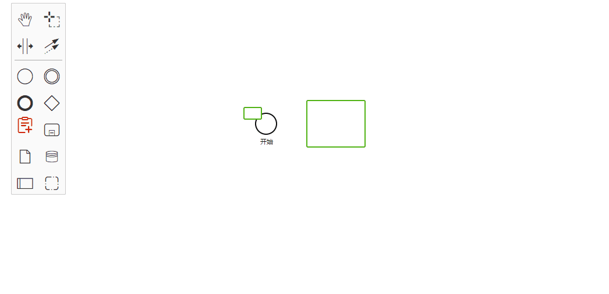

# 自定义 Rules

为 Bpmn 加上新的规则约束。

## 开始

#### 1. 创建相关文件

老规矩，准备好文件。这里直接从 `bpmn-js-examples` 中的[custom-modeling-rules](https://github.com/bpmn-io/bpmn-js-examples/tree/master/custom-modeling-rules/lib/custom-rules)

建立自定义规则的相关文件，结构如下

```cmd
| -- rules
    |-- CustomRules.js
    |-- index.js
```

#### 2. 修改

index.js

```js
import CustomRules from './CustomRules'

export default {
  __init__: ['customRules'],
  customRules: ['type', CustomRules]
}
```

把注释一去，代码其实并不多。

CustomRules.js

```js
import inherits from 'inherits'

import RuleProvider from 'diagram-js/lib/features/rules/RuleProvider'

export default function CustomRules(eventBus) {
  RuleProvider.call(this, eventBus)
}

inherits(CustomRules, RuleProvider)

CustomRules.$inject = ['eventBus']

CustomRules.prototype.init = function() {
  this.addRule('shape.create', function(context) {
    var shape = context.shape,
      target = context.target
    var shapeBo = shape.businessObject,
      targetBo = target.businessObject

    var allowDrop = targetBo.get('vendor:allowDrop')

    if (!allowDrop || !shapeBo.$instanceOf(allowDrop)) {
      return false
    }
  })
}
```

可以看到我们 `CustomRules` 是继承 `diagram RuleProvider`, 上面代码直接贴是没效果的。
看了下 [RuleProvider 源码](https://github.com/bpmn-io/diagram-js/blob/develop/lib/features/rules/RuleProvider.js),
主要看 `this.addRule()` 这个方法。

```js
/**
 * @param {string|Array<string>} actions the identifier for the modeling action to check
 * @param {number} [priority] the priority at which this rule is being applied
 * @param {Function} fn the callback function that performs the actual check
 */
RuleProvider.prototype.addRule = function (actions, priority, fn) {...}
```

可以看到是三个参数，所以为`this.addRule()` 加上 `优先级` 这个参数就好了。

```js
this.addRule('shape.create', 1234, function(context) {
  // context 根据 context 对象作为判断条件
  // return false // 不通过
  // return true // 通过
  // viod // 也就是无返回，进入下一个规则
})
```

#### 3. 引用

引入刚刚创建的文件

```js
import customRules from './CustomRules'
```

```js
export default {
  // ...
  init() {
    this.bpmnModeler = new BpmnModeler({
      additionalModules: [customRules]
    })
    // ...
  }
}
```

#### 4. 相关规则事件

可以参考里面的事件：[BpmnRules](https://github.com/bpmn-io/bpmn-js/blob/develop/lib/features/rules/BpmnRules.js),

#### 5.完成

看一下效果,同时阻止了两个事件的发生

```js
this.addRule(['connection.create', 'shape.create'], 1234, function(context) {
  console.log('context', context)
  return false
})
```



以上只是一个简单的实例。

不能完全阻止元素生成， 因为还有 `ContextPad`可以生成元素，需要找到阻止他的事件。

## 最后

[rules 案例代码](https://github.com/PL-FE/bpmn-doc/tree/main/src/components/rules)

完整目录： 👉 [点击这里](https://github.com/PL-FE/bpmn-doc/blob/main/README.md)

### 相关

可能对你有帮助的官方资源：

- [custom-modeling-rules](https://github.com/bpmn-io/bpmn-js-examples/tree/master/custom-modeling-rules/lib/custom-rules)
- [bpmn-js-examples](https://github.com/bpmn-io/bpmn-js-examples/tree/master/)
