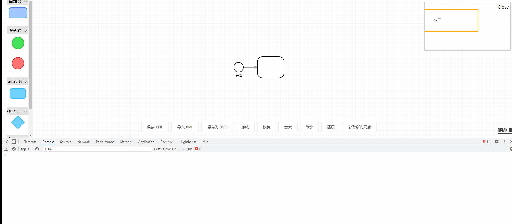

# 答疑 （持续更新）

<a href="#1-如何自定义-id">1 如何自定义 id</a>

<a href="#2-保持居中">2 保持居中</a>

<a href="#3-元素如何放大缩小">3 元素如何放大缩小</a>

## 1 如何自定义 id

**如何将 id,例如 `Task_1hcentk` 改成自己想要的格式 ？**

先看看源码怎么写
[bpmn-js/lib/features/modeling/BpmnFactory.js](https://github.com/bpmn-io/bpmn-js/blob/develop/lib/features/modeling/BpmnFactory.js#L44)

```js
BpmnFactory.prototype._ensureId = function(element) {
  // generate semantic ids for elements
  // bpmn:SequenceFlow -> SequenceFlow_ID
  var prefix

  if (is(element, 'bpmn:Activity')) {
    prefix = 'Activity'
  } else if (is(element, 'bpmn:Event')) {
    prefix = 'Event'
  } else if (is(element, 'bpmn:Gateway')) {
    prefix = 'Gateway'
  } else if (isAny(element, ['bpmn:SequenceFlow', 'bpmn:MessageFlow'])) {
    prefix = 'Flow'
  } else {
    prefix = (element.$type || '').replace(/^[^:]*:/g, '')
  }

  prefix += '_'

  if (!element.id && this._needsId(element)) {
    // 关键在这里，我们也可以拿它的id生成器结合我们的一起使用
    element.id = this._model.ids.nextPrefixed(prefix, element)
  }
}
```

可知，他的默认格式是 `${type}_${id}`, 其中 id 部分是由 `_model.ids.nextPrefixed` 生成

然后需要知道 id 是什么时候生成的？ id 是点击拖动 `palette` 工具栏元素的时候生成的。
那么我们只要修改工具栏代码即可。

[CustomPalette.js](https://github.com/PL-FE/bpmn-doc/blob/dev/src/views/bpmn/customBpmn/palette/CustomPalette.js)

```js

// 1
Palette.$inject = [
  'eventBus',
  'canvas',
  'elementFactory',
  'bpmnFactory', // 新增
  'moddle', // 新增
  'create',
  'config.paletteContainer',
  'config.paletteEntries'
]
// 顺序一一对齐
// 2
function Palette(
  eventBus,
  canvas,
  elementFactory,
  bpmnFactory, // 新增
  moddle, // 新增
  create,
  paletteContainer,
  paletteEntries
) {
  // ....
  this._bpmnFactory = bpmnFactory
  this._model = moddle
}
// 3
Palette.prototype.trigger = function () {
   var bpmnFactory = this._bpmnFactory
   var model = this._model

  // simple action (via callback function)
  //  传入 action 的 dragstart方法 click 方法
  // 传入 bpmnFactory
  if (isFunction(handler)) {
    if (action === 'click') {
      handler(originalEvent, autoActivate, elementFactory, bpmnFactory, model, create)
    }
  } else {
    if (handler[action]) {
      handler[action](originalEvent, autoActivate, elementFactory, bpmnFactory, model, create)
    }
}

// 4
// 最后就调用
// https://github.com/PL-FE/bpmn-doc/blob/dev/src/views/bpmn/config/paletteEntries.js#L60
function createListener(
    event,
    autoActivate,
    elementFactory,
    bpmnFactory, // 新增 bpmnFactory 入参，为了创建业务对象
    model, // 生成随机码
    create
  ) {
    const prefix = type + +new Date() + '_'
    const id = model.ids.nextPrefixed(prefix, { type })
    // 我们的id格式为 ${type}${new Date()}_${id}
    const taskBusinessObject = bpmnFactory.create(type, { id, name: id })

    var shape = elementFactory.createShape(
      assign({ type: type }, options, { businessObject: taskBusinessObject })
    )
  // ...
  }
```

完整代码可以看 [git 提交记录](https://github.com/PL-FE/bpmn-doc/commit/cb87c82395e09c6ac2bfb67b60e89dfae5941fa8#diff-d6c517822a17ee1a8eec16d033fb6cb4077cf77bc763d34bad1b9c36b5aba5dc)

最后，`contextPad` 面板的元素生成也需要处理，代码与 `palette` 类似，不重复说明。
在线预览：[http://bpmn-doc.pl-fe.cn/](http://bpmn-doc.pl-fe.cn/)
如果我写的不是很清楚，那么这里有一些极简例子[选择业务对象](https://pl-fe.github.io/bpmn-modeling-api-cn.github.io/)


## 2 保持居中

> 如有副作用，欢迎交流

期望效果：

实际上，画布在快速改变的第一时间拿到的是缓存的尺寸。导致居中计算不正确。如下


解决方法，每次拿最新的画布尺寸。即重写一些居中的方法。
关键代码： https://github.com/bpmn-io/diagram-js/blob/develop/lib/core/Canvas.js#L976

```js
Canvas.prototype._fitViewport = function(center) {
  // var vbox = this.viewbox() 修改成如下
  var vbox = this.viewbox(false)
  // ...
}
```

```js
Canvas.prototype.viewbox = function(box) {
  // 由此可看到，当 box 不传值时，默认拿到的是缓存
  if (box === undefined && this._cachedViewbox) {
    return this._cachedViewbox
  }
  // ...
  // 入参为 false 将走进这个判断，获取最新的画布尺寸。
  if (!box) {
  }
}
```

完整代码：

```js
import {
  addResizeListener,
  removeResizeListener
} from 'element-ui/src/utils/resize-event'

export default {
  mounted() {
    addResizeListener(this.$refs.canvas, this.resizeListener)
  },
  beforeDestroy() {
    removeResizeListener(this.$refs.canvas, this.resizeListener)
  },
  resizeListener() {
    const canvas = this.bpmnModeler.get('canvas')
    _fitViewport.call(canvas, true)
  }
}

function _fitViewport(center) {
  var vbox = this.viewbox(false)
  var outer = vbox.outer
  var inner = vbox.inner
  var newScale
  var newViewbox

  if (
    inner.x >= 0 &&
    inner.y >= 0 &&
    inner.x + inner.width <= outer.width &&
    inner.y + inner.height <= outer.height &&
    !center
  ) {
    newViewbox = {
      x: 0,
      y: 0,
      width: Math.max(inner.width + inner.x, outer.width),
      height: Math.max(inner.height + inner.y, outer.height)
    }
  } else {
    newScale = Math.min(
      1,
      outer.width / inner.width,
      outer.height / inner.height
    )
    newViewbox = {
      x: inner.x + (center ? inner.width / 2 - outer.width / newScale / 2 : 0),
      y:
        inner.y + (center ? inner.height / 2 - outer.height / newScale / 2 : 0),
      width: outer.width / newScale,
      height: outer.height / newScale
    }
  }

  this.viewbox(newViewbox)

  return this.viewbox(false).scale
}
```

## 3 元素如何放大缩小

效果


https://github.com/philippfromme/camunda-modeler-plugin-resize-tasks
https://github.com/ElCondor1969/bpmn-js-task-resize
